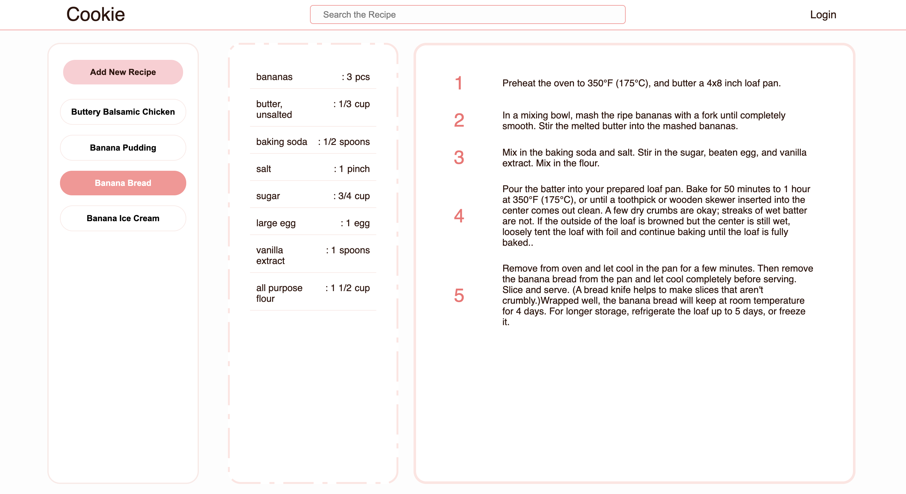
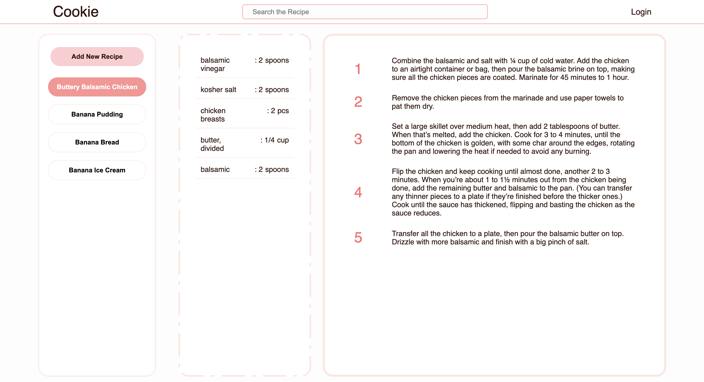
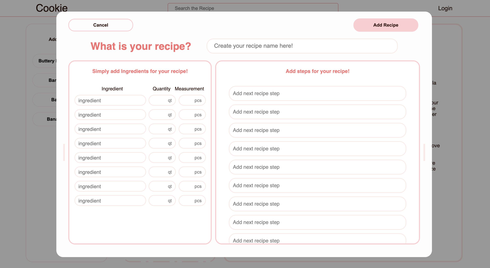

<!-- PROJECT LOGO -->
<br />
<h1 align="center">Cookie</h1>
<p align="center">cooking recipe app v.1.0</p>

<!-- GETTING STARTED -->

## Getting Started

### Installation

1. Clone the repo
2. install dependencies
   ```sh
   npm install
   ```
3. create an .env file in the root directory filling in your personal DB_host (MongoDB):

   ```
   # Database
   DB_HOST=your.db.here

   ```

<!-- USAGE EXAMPLES -->

## Usage

Simply add your favorite recipes and have your own recipe book:

- Find the recipe name and click it to see the recipe <br />

 <br /> <br />

 <br /><br />

- Add your own recipe <br />


